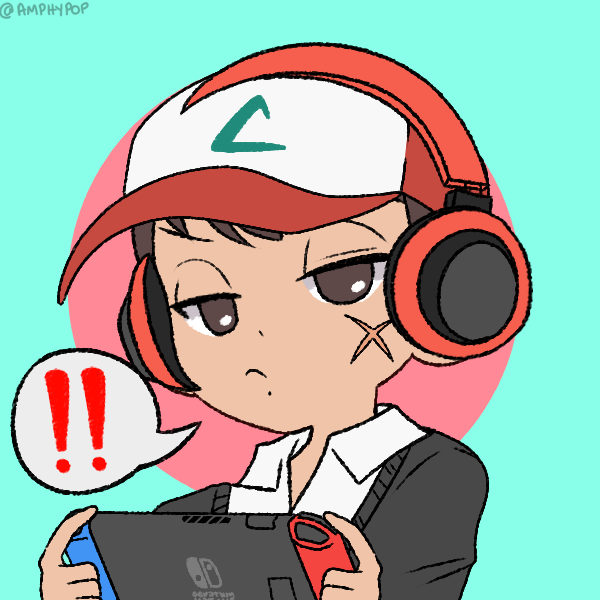

### Seja bem Vindo !  
  
  ##
  
  
  - 👨‍💻 Trabalhando como Analista de Ti...
  - 📱 Tec. Eletrônica Formado...
  - 🎓 Graduando Ciências da computação...
  - 📚 Estudando Python...
  - 🎬 Editor de video nas horas vagas...
  - 🕹️Conserto video games Retrô por amor...
  - 🏈 Jogador de Football Americano...
  - 🐕 Pai da Beagle Nala...
 

 
  
  
                                                                                 
  
  
  

 
    
 ##

  <a href="https://github.com/lucasmarchiori94">
  
  

  

 
  
  
  
  
  
  
  
  
  

  
  ##
  

  
  
 	
 
  

  
  
   
                                                                                                                                                          
 ##
  

  

##  
  

 
    
    
    
    
    

  ##

